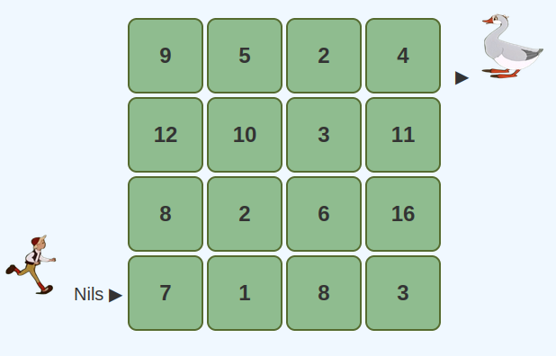

# Nils' Abenteuer

## Play / Spiel starten

[► Play Nils' Abenteuer](https://pythonyu.com/nils/nils.html)

---

**Spiel & Aufgabe**
In einem fernen Königreich, jenseits blauer Meere und hoher Berge, lebte ein kluger Junge namens Nils. Nachdem er die Schule beendet hatte, sah er auf dem Heimweg eine Gans, die dringend Getreidekörner brauchte. Um ihr zu helfen, musste Nils gefährliche kleine Inseln überwinden und auf jeder Insel die richtige Menge an Körnern einsammeln. Insgesamt sollte Nils genau **40 Körner** sammeln.

Nils darf sich nur nach **rechts (→)** und nach **oben (↑)** bewegen (links und unten sind verboten).
Jede Insel zeigt an, wie viele Körner Nils dort sammeln kann (Zahlen im Feld).
Finde den Weg, auf dem Nils genau **40 Körner** sammelt!

---

## Kurz-Anleitung / How to play

**Deutsch (kurz):**
Bewege Nils nur nach rechts (→) oder oben (↑). Sammle auf jeder Insel die angegebene Anzahl Körner. Ziel: genau **40 Körner**.

**English (short):**
Move Nils only to the right (→) or up (↑). Collect the number of grains shown on each island. Goal: collect **exactly 40 grains**.

---

## Hinweis / Notes

* Für Hinweise oder Fragen kannst du die Projektseite besuchen (Link oben).
* Du kannst diese README als Einleitung auf GitHub/GitLab oder auf einer Projektseite verwenden — der Link führt direkt zur Spielseite.

### Support the project PayPal💖

### Support the project Skrill 💳

**Donate via Skrill**
- send money to autocadmdav@gmail.com
  

